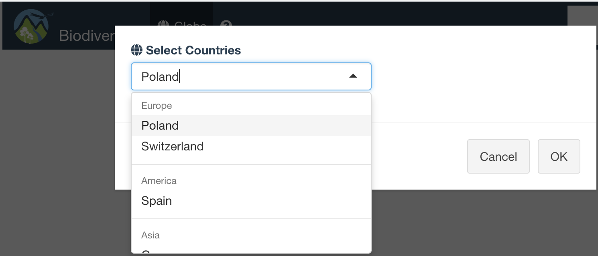

<!-- README.md is generated from README.Rmd. Please edit that file! -->

# biodiversity Map Tracker 

# How to install and run

Before to install, please try to [demo](https://kmezhoud.shinyapps.io/biodiversity/) version.

### R

```{r}
require(devtools)
install_github("kmezhoud/biodiversity")
library(biodiversity)
biodiversity()
```
### Docker

```{bash}
coming ...
```
 
 


# Skills
+ biodiversity is a complete R package
  + Build/Check/Test package
+ Add popup to select interested countries to focus on. 
  + Reduce waiting time and improve reactivity of the App.
  + Limit functionalities to wanted countries
+ Add Progressbar to inform the user what the app is doing
+ Add a Layout control panel for existing Kingdom
  + Rapid Overview of the position of Animals, Plants and Others
  + User can focus search by Kingdom
+ User can search by `vernacularName`, the app returns `scientificName` and vice versa.
+ Map Focusing process of selected item to the position
  + Indicate the position with red circle
  + Open popup with all needed information: 
    + External link to orginal data
    + Images
+ CSS styling with logos in header, Absolute Panel with transparent Button

# Deal with occurence.cvs and multimedia.csv

### Locate the column of country
```{r}
read.table(file = "biodiversity-data/occurence.csv", header = TRUE,
              sep = ",", nrows = 1) %>%
  names() %>%
  stringr::str_locate(fixed("country", ignore_case=TRUE) ) %>%
  as_tibble()%>%
  tibble::rowid_to_column("index") %>%
  drop_na() %>%
  pull(index)

```
[1] 22 23

### Extract only rows with Poland in column 22 and save it to occurence_poland.csv
```{bash}
awk -F, '$22 ~ /^Poland/' "biodiversity-data/occurence.csv" > occurence_poland.csv
```

### Load only used columns from multimedia
```{r}
multimedia <- fread("biodiversity-data/multimedia.csv", header = TRUE,
                    select = c("CoreId", "accessURI")) %>%
  rename( id = CoreId) %>%
  mutate(id = as.factor(id))
```

### Join Files
```{r}

occurence <- fread("occurence_poland.csv", header = TRUE, sep= ',', 
                   select = c("id", "eventDate", "eventTime", "locality", "kingdom", "family",
                              "vernacularName", "scientificName", "longitudeDecimal", "individualCount", "latitudeDecimal", "countryCode","references"))
                              
occurence <- occurence %>%
              select_if(function(x) !(all(is.na(x)) | all(x==""))) %>%
              mutate(eventDate = as.POSIXct(eventDate,format="%Y-%m-%d")) %>%
              #mutate(modified = as.POSIXct(modified,format="%Y/%m/%d")) %>%
                tidyr::extract(col = locality, into = c("country", "locality"),
                             regex =  "([A-Z]+[a-z]+\\s)-(\\s[A-Z]+[a-z]+)",remove = TRUE)  %>%
               mutate(kingdom = if_else(kingdom == "", "Unknown", kingdom)) %>%
              mutate(id = as.factor(id), kingdom = as.factor(kingdom),
                     family = as.factor(family), locality = as.factor(locality),
                     vernacularName = as.factor(vernacularName),
                     scientificName = as.factor(scientificName)) 


full_data_poland <- occurence %>%
                    left_join(multimedia, by="id") 

saveRDS(full_data_poland, file = "inst/biodiversity/extdata/full_data_poland.rds")
```

# Keywords
+ Freq: How many time the Spacy was found in different place or date.time
+ Total: The sum of all individus
+ We can add any needed informations in Popups.

# Issues
+ **Cannot deploy the App to shinyapp.io with Poland and Switzerland data**
+ Loading countries.geojson file makes the app slowly
  + Use simpliest map
+ addSearchFeatures highlight multiple circles with same name
  + In some case Image not found in app but exists in Link (case red Fox)
+ addSearchFeatures with multiple addCircles groups
  + All Kingdoms must be checked for the `addSearchFeatures`
+ Extend the app to others countries by passing the name of countries as an argument `biodiversity(countries = c("Poland", "Germany"))`
  + Not a good idea if we deploy app in server.
    + Use instead popup with selectInput of countries at the starting.
+ AddCircles from groups (Fungi and Unknown) that not exist in selected country 
+ The number of Kingdoms in countries is not the same. `addCircles` not working with empty dataframe
+ Display Map after `Ploting...` progressBar takes long time if there are a lot of CircleMarkers

# TO DO
+ Extend countries to Provinces and Localities: improve precision and search.
+ Subset each country in CSV/RDS file /extdata and load only selected countries
+ Map focus and zoom to first selected country
+ Add botton to the map to iterate countries selection
+ Dockerize the App
