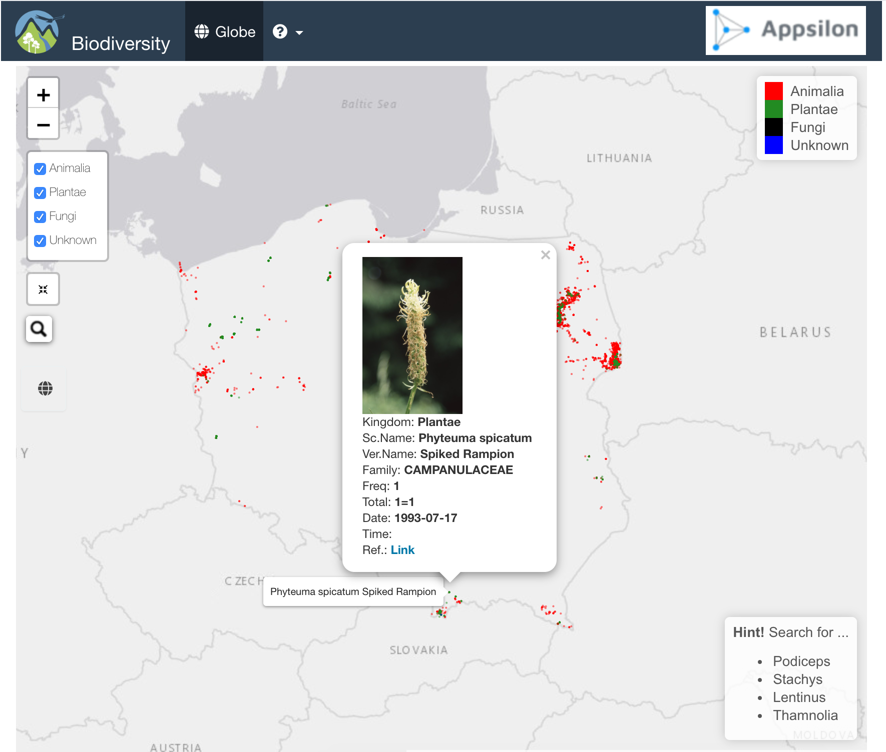

<!-- README.md is generated from README.Rmd. Please edit that file! -->

# biodiversity Map Tracker 

# How to install and run

```r
require(devtools)
install_github("kmezhoud/biodiversity")
library(biodiversity)
biodiversity()
```

  


# Keywords
+ Freq: How many time the Spacy was found in different place or date.time
+ Total: The sum of all individus

# Skills
+ biodiversity is a complete R package
  + Build/Check/Test package
+ Add Progressbar to inform the user what the app is doing
+ Add a Layout control panel for existing Kingdom
  + Rapid Overview of the position of Animals, PLants and Others
  + User can focus search on `Plantae` by checking Plantae
+ User can search by `vernacularName`, the app returns `scientificName` and vice versa.
+ Map Focusing process of selected item to the position
  + Indicate the position with red circle
  + Open popup with all needed information: 
    + External link to orginal data
    + Images
+ CSS styling with logos in header
    

# Issues
+ Loading countries.geojson file makes the app slowly
+ addSearchFeatures highlight multiple circles with same name
+ addSearchFeatures with multiple addCircles groups
+ All Kingdoms must be checked for the `addSearchFeatures`