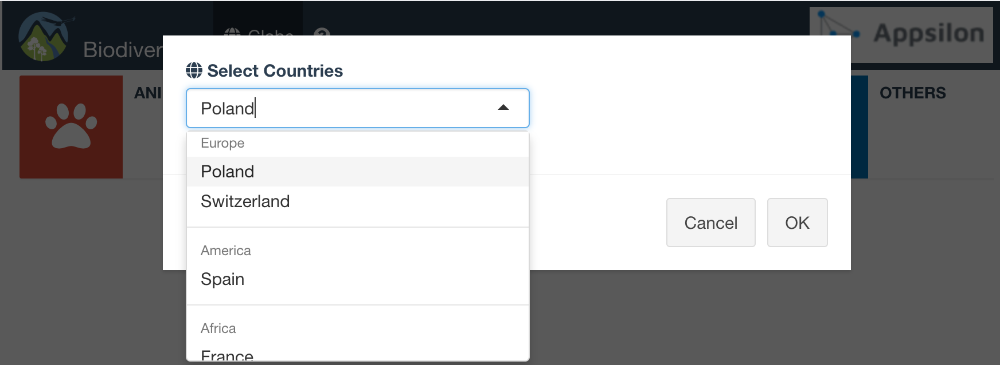
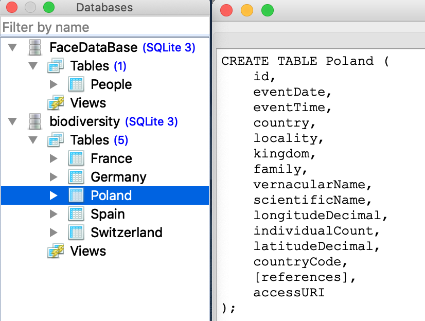
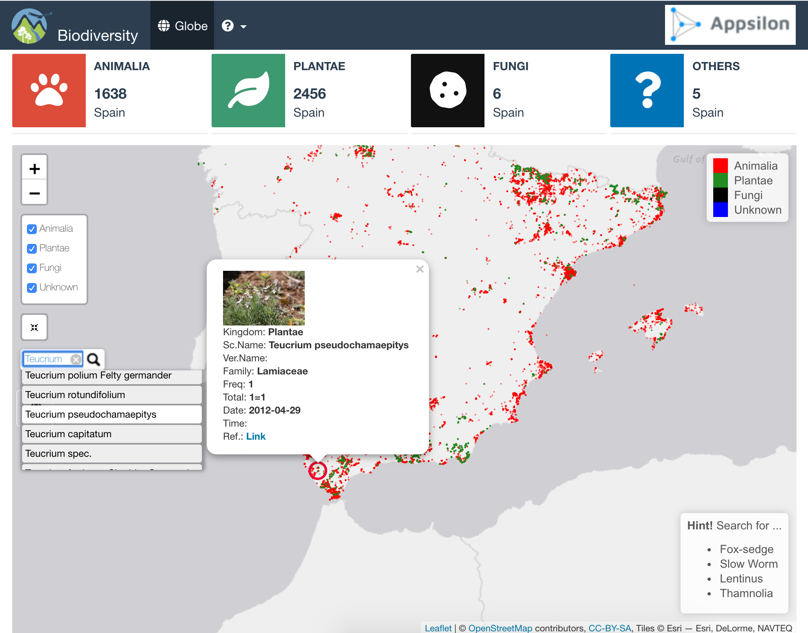
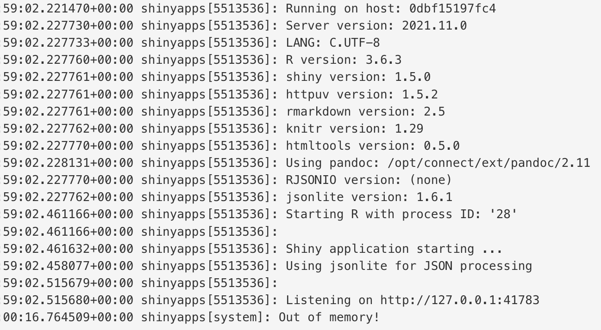
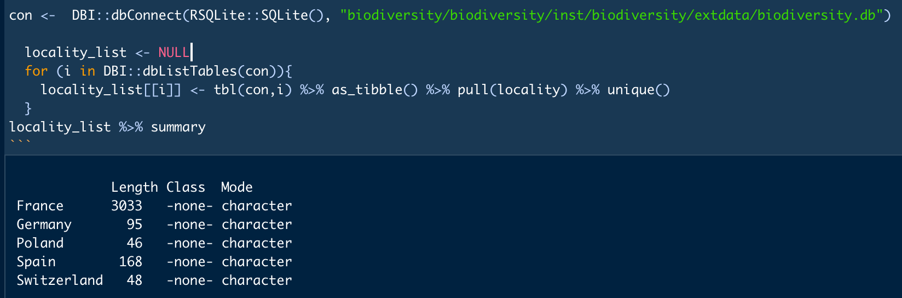
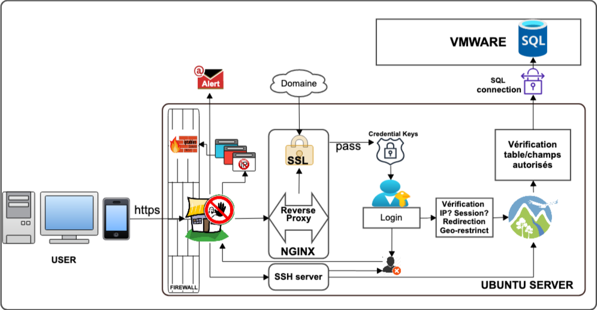

# biodiversity Map Tracker 

# How to install and run

Before to install, please try to
[demo](https://kmezhoud.shinyapps.io/biodiversity/) version.

### R Environment

``` r
require(devtools)
install_github("kmezhoud/biodiversity")
library(biodiversity)
biodiversity()
```

### Docker Image

#### How to build Docker Image

Navigate to where `Dockerfile` and `DESCRIPTION` folder.

``` bash
docker build --tag biodiversity .
docker tag biodiversity kmezhoud/biodiversity:0.1
docker push kmezhoud/biodiversity:0.1
```

#### How to run

``` bash
 # docker login -u kmezhoud
 # run local check navigator at 127.0.0.1:3838
 # docker run -d -p  3838:3838 kmezhoud/biodiversity:0.1
 # run from dockerHub 
 docker run -d -p  3838:3838 kmezhoud/biodiversity:0.1
 
 ## killing container issue
 ## container_linux.go:392: signaling init process caused "permission denied": unknown
 ## sudo aa-remove-unknown
## Removing '/snap/core/11993/usr/lib/snapd/snap-confine'
## Removing 'docker-default'
```






# Extras Skills

- biodiversity is a complete R package
  - Build/Check/Test package
- Docker container is available.
- Extend search to multiple countries: Poland, Switzerland, Germany,
  France, Spain.
- Convert csv files to sqlite database.
  - Faster read of tables
  - focus search on selcted tables
- Add popup to select interested countries to focus on.
  - Reduce waiting time and improve reactivity of the App.
  - Limit functionalities to wanted countries
- Add Progressbar to inform the user what the app is doing
- Starting Map position focus of the mean(s) of latitude(s) and
  longitude(s) of selected Countri(es).
  - User do not need to scroll the map to selected countries.
- Add a Layout control panel for existing Kingdom
  - Rapid Overview of the position of Animals, Plants and Others
  - User can focus search by Kingdom
- User can search by `vernacularName`, the app returns `scientificName`
  and vice versa.
- After searching and selected species from the search engine, the Map
  go and Focus on item position with:
  - Indicate the position with red circle, and
  - Open popup with all needed information:
    - External link to original data,
    - How many times the species has been encountered,
    - Individual Count in each encounter,
    - Image,
    - Link to reference.
- Button to iterate search if user want to change/select other countries
- Info Boxes indicating the total of each existing king.
- CSS styling with logos in header, Absolute Panel with transparent
  Button

<br>

# Deal with occurence.cvs and multimedia.csv

### Locate the column of the countries

``` r
read.table(file = "biodiversity-data/occurence.csv", header = TRUE,
              sep = ",", nrows = 1) %>%
  names() %>%
  stringr::str_locate(fixed("country", ignore_case=TRUE) ) %>%
  as_tibble()%>%
  tibble::rowid_to_column("index") %>%
  drop_na() %>%
  pull(index)
```

\[1\] 22 23

### Extract only rows with Poland and Switzerland in column 22 and save it to occurence_poland_Switezerland.csv

``` bash
awk -F, '$22 ~ /^Poland|Switzerland/' "biodiversity-data/occurence_poland_Switezerland.csv" > occurence_poland.csv
```

### Load only used columns from multimedia

``` r
multimedia <- fread("biodiversity-data/multimedia.csv", header = TRUE,
                    select = c("CoreId", "accessURI")) %>%
  rename( id = CoreId) %>%
  mutate(id = as.factor(id))
```

### Join Files

``` r

occurence <- fread("occurence_poland_Switzerland.csv", header = TRUE, sep= ',', 
                   select = c("id", "eventDate", "eventTime", "locality", "kingdom", "family",
                              "vernacularName", "scientificName", "longitudeDecimal", "individualCount", "latitudeDecimal", "countryCode","references"))
                              
occurence <- occurence %>%
              select_if(function(x) !(all(is.na(x)) | all(x==""))) %>%
              mutate(eventDate = as.POSIXct(eventDate,format="%Y-%m-%d")) %>%
                tidyr::extract(col = locality, into = c("country", "locality"),
                             regex =  "([A-Z]+[a-z]+\\s)-(\\s[A-Z]+[a-z]+)",remove = TRUE)  %>%
              mutate(kingdom = if_else(kingdom == "", "Unknown", kingdom)) %>%
              mutate(id = as.factor(id), kingdom = as.factor(kingdom),
                     family = as.factor(family), locality = as.factor(locality),
                     vernacularName = as.factor(vernacularName),
                     scientificName = as.factor(scientificName)) 


full_data_polanSwitzerland <- occurence %>%
                              left_join(multimedia, by="id") 

write.csv(full_data_polanSwitzerland, file = "inst/biodiversity/extdata/full_data_poland_Switzerland.csv")
```

## Convert occcurence.csv and multimedia.csv to sqlite database

# Keywords

- Freq: How many time the species was found in different place or
  date.time
- Total: The sum of all individus
- We can add any needed informations in Popups.

# Issues

- addSearchFeatures highlight multiple circles with same species.
- In some case Image not found in app but exists in Link (case red Fox)
  - search feature process seems to go to the first matched regex and
    stop search.
- addSearchFeatures works if all groups are checked
  - All Kingdoms must be checked for the `addSearchFeatures`
- The number of Kingdoms in countries is not the same. For examaple in
  Czechia there is no `Fungi` nor `Unknown`. `addCircles` function for
  `Fungi` and `Unknown` received empty data.frame which makes error.
  - Try `if_else` condition with `%>%` like
    - `... %>% {if_else(nrow(biodiversity_data_Animalia)>0, addCiles(...), .)} %>% ...`
      or
    - `... %>% purrr::when(nrow(biodiversity_data_Animalia)>0, ~addCircles(...), ~.) %>% ...`
      .

  ``` r
  Warning: Error in dispatch: argument "map" is missing, with no default
  114: dispatch
  113: invokeMethod
  109: addCircles
  108: eval
  107: eval
  106: purrr::when
  105: function_list[[i]]
  104: freduce
  103: _fseq
  102: eval
  101: eval
   99: %>%
   95: func [frontPage.R#97]
   82: origRenderFunc
   81: output$worldMap
    1: runApp
  ```
- Display Map after `Ploting...` progressBar takes long time if there
  are a lot of CircleMarkers.
  - It depends on screen resolution and computer features. <br>
- Loading countries.geojson file makes the app slowly \[solved\]
  - Use simplest map
- Extend the app to others countries by passing the name of countries as
  an argument `biodiversity(countries = c("Poland", "Germany"))`
  \[outdated\]
  - Not a good idea if we deploy app in server.
    - Use instead popup with `selectInput` of countries at the starting
      \[solved\]
- shinyapp.io is out of memory during Plot of Germany, Spain, France.



# To Do

- Extend countries to Provinces and Localities: improve precision and
  search. In some case there a lot of locality (example France)

  

# Deploy App using Cloud and Shiny Server

The shiny App can be deployed in any Cloud service like
[DigitalOcean](https://www.digitalocean.com/) with Ubuntu server.

``` bash
# connect to the remote server
ssh remote_username@remote_host
#add user with root privilege
adduser kirus
gpasswd -a kirus sudo
su - kirus
# install nginx
sudo apt-get update
sudo apt-get -y install nginx
# Set virtual domain name
# add source for most recent version of R  for ubuntu 18.04
sudo sh -c 'echo "deb http://cran.rstudio.com/bin/linux/ubuntu bionic-cran40/" >> /etc/apt/sources.list'
gpg --keyserver keyserver.ubuntu.com --recv-key E298A3A825C0D65DFD57CBB651716619E084DAB9
gpg -a --export E298A3A825C0D65DFD57CBB651716619E084DAB9 | sudo apt-key add -
# install R
sudo apt-get update
sudo apt-get -y install r-base
# install useful packages
sudo apt-get -y install libcurl4-gnutls-dev libxml2-dev libssl-dev
sudo su - -c "R -e \"install.packages('promises', repos='http://cran.rstudio.com/')\""
# install rstudio server
sudo apt-get install gdebi-core
wget https://download2.rstudio.org/server/bionic/amd64/rstudio-server-1.4.1106-amd64.deb
sudo gdebi rstudio-server-1.4.1106-amd64.deb
# check browser at 10.11.12.121:8787/

# install shiny server
sudo su - -c "R -e \"install.packages('shiny', repos='http://cran.rstudio.com/')\""
sudo su - -c "R -e \"install.packages('rmarkdown', repos='http://cran.rstudio.com/')\""
wget https://download3.rstudio.org/ubuntu-14.04/x86_64/shiny-server-1.5.15.953-amd64.deb
sudo gdebi shiny-server-1.5.15.953-amd64.deb
# chack browser at http://10.11.12:3838/

# install biodiversity dependencies
sudo su - -c "R -e \"install.packages(c('shiny','shinytheme'), repos='http://cran.rstudio.com/')\""
sudo su - -c "R -e \"install.packages(c('leaflet', 'leaflet.extras', 'countrycode'), repos='http://cran.rstudio.com/')\""
sudo su - -c "R -e \"install.packages(c('tidyverse','data.table' ), repos='http://cran.rstudio.com/')\""

## install biodiversity from github if public
sudo su - -c "R -e \"devtools::install_github('kmezhoud/biodiversity')\""

## other option built binary source tar.gz and install it as a root
#Build package in /home/kirus
sudo su - -c "R -e \"install.packages(“/home/kirus/biodiversity.01.tar.gz”, type=”source”)\""
```

``` bash
#The next step is to change the owner of the package folder
chown -R shiny:shiny /usr/local/lib/R/site-library/biodiversity/
# or
chown -R shiny:shiny /home/kirus/R/x86_64-pc-linux-gnu-library/4.0/biodiversity/
systemctl restart shiny-server
# or change shiny-server.conf rus_as “kirus” (where is the package are build) instead “shiny”
# This is also right for the zintr package if installed in  /home of the kirus profile.

# set shiny-server.conf
nano /etc/shiny-server/shiny-server.conf
## Add the following section

location /biodiversity {
 app_dir /usr/local/lib/R/site-library/biodiversity/biodiversity;
 log_dir /var/log/shiny-server;
 directory_index on;
 }

# check browser at http://192.168.10.1:3838/biodiversity
```

# Security System

It can be protected by a strong security system:

- Firewall with iptable and email Alert

- Reserve Proxy with SSL and Domaine certificate

- Keyring system for sensitive code like: Login detail, IP adress,
  tables and column names

- IP verification and geo-restrinction



# Mobile App

The App can be implemented for Smartphone using [F7
framework](https://framework7.io/).
